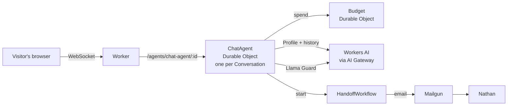

# natbot

A chat-first resume at **[ask.nathanarthur.com](https://ask.nathanarthur.com)**. Recruiters and hiring managers ask questions about Nathan Arthur's career and get answers from a curated profile. When the profile doesn't cover a question, they can send it to Nathan and he replies by email.

It started as the optional AI assignment on a Cloudflare application. It runs on Cloudflare, with Handoff email sent through Mailgun:

| Assignment requirement | Here |
| --- | --- |
| LLM | Qwen 3.8 27B on Workers AI, through AI Gateway |
| Workflow / coordination | One Durable Object per Conversation (Agents SDK), Budget Durable Objects that cap daily answers and Handoffs, and a Workflow that emails Handoffs to Nathan with retries |
| User input via chat | A React chat page served as Workers static assets and streamed over WebSocket |
| Memory / state | Each Conversation's history lives in its Durable Object's SQLite and is resumed from the same browser. It is forgotten 30 days after the last question. |

The prompts used to build it are in [PROMPTS.md](PROMPTS.md). [docs/process.md](docs/process.md) describes what surrounded them: the standing instructions, skills, review loop, hooks and checks that shaped each change.

## How it works



- **Answers.** Every prompt holds the whole [Profile](profile.md), with no retrieval ([ADR 0002](docs/adr/0002-whole-profile-in-context.md)). The model sees only history the server recorded itself. History a client sends is ignored, so a Visitor can't plant fake assistant turns. See [`src/worker/answer.ts`](src/worker/answer.ts).
- **Handoffs.** The model has one tool, `draftHandoff`, which has no effect: it only puts an editable draft on the page ([ADR 0003](docs/adr/0003-one-effect-free-tool.md)). Nothing is sent until the Visitor adds an email address and presses Send. That runs checks and a moderation pass, then starts a durable Workflow that emails Nathan with the Visitor as Reply-To ([ADR 0004](docs/adr/0004-mailgun-for-handoff-email.md)). See [`src/worker/handoff.ts`](src/worker/handoff.ts) and [`src/worker/workflow.ts`](src/worker/workflow.ts).
- **Forgetting.** Each question pushes a Conversation's 30-day timer back. When the timer fires, the Durable Object destroys itself and everything in it.

## Abuse hardening

A public, anonymous LLM endpoint is an attack surface, so the defenses are layered and each one fails independently:

- **Cost.** Per-IP connect and per-Conversation message rate limits, plus a Budget Durable Object that hard-caps model calls per day (1,000 answers and 20 Handoffs).
- **Bots.** Turnstile checks each Conversation once, on whichever comes first: its first question or a Handoff sent before any question. Siteverify checks the hostname and action ([ADR 0005](docs/adr/0005-turnstile-guards-the-first-question.md)).
- **Prompt injection and persona breaks.** The system prompt is a set of absolute rules ([`src/worker/prompt.ts`](src/worker/prompt.ts)). The assistant turn can't be prefilled. The Profile is curated, so private data never reaches the model ([ADR 0001](docs/adr/0001-curated-public-profile.md)).
- **Actions.** The model has no tool with an effect. Handoffs are capped per Conversation and per day, and Llama Guard screens them before they're sent.
- **Evals.** An adversarial suite runs the real answer pipeline against 29 cases in these categories: off-topic pulls, persona breaks, fabrication pressure, damaging statements, private-data probing, prompt injection, Handoff abuse, and controls the bot must still answer. Deterministic checks and an LLM judge (`gpt-oss-120b`) grade the answers. A separate, non-blocking Eval workflow runs it on PRs that touch the Profile, prompt, answer flow or eval suite, and posts the results as a PR comment. Answers vary between runs, so the workflow never fails a PR. It chose the production model: 78/87 for Qwen 3.8 27B against 61/87 for Llama 3.3 70B ([#20](https://github.com/narthur/natbot/pull/20)).

## Running it

Try it at [ask.nathanarthur.com](https://ask.nathanarthur.com), or run it locally. Local runs need Node 22, pnpm 10 and a Cloudflare account, because Workers AI always runs remotely.

```sh
pnpm install
pnpm wrangler login
```

Create `.dev.vars` with Turnstile's always-pass test secret and a placeholder Mailgun key. Local Handoffs then fail at Mailgun and retry, so no mail is sent:

```sh
TURNSTILE_SECRET_KEY=1x0000000000000000000000000000000AA
MAILGUN_API_KEY=placeholder
```

The chat calls Workers AI through an [AI Gateway](https://developers.cloudflare.com/ai-gateway/) named `natbot`. If your account doesn't have one, create it in the dashboard.

```sh
pnpm dev      # the app, with the Worker and Durable Objects, at the printed localhost URL
pnpm test     # unit tests, including a check that the Profile stays within its token budget
pnpm eval     # the adversarial eval against real Workers AI; EVAL_MODEL=<model> compares another model, EVAL_RUNS=3 repeats cases
```

Merges to `main` build and deploy through GitHub Actions ([`deploy.yml`](.github/workflows/deploy.yml)). Production needs the `TURNSTILE_SECRET_KEY` and `MAILGUN_API_KEY` Worker secrets (`pnpm wrangler secret put <NAME>`). The deploy workflow needs the `CLOUDFLARE_API_TOKEN` and `CLOUDFLARE_ACCOUNT_ID` repo secrets, and the eval workflow needs `CLOUDFLARE_AI_TOKEN` and `CLOUDFLARE_ACCOUNT_ID`. To deploy your own copy, also change the custom-domain route in `wrangler.jsonc` and the Turnstile site key in `src/turnstile.ts`.

## Layout

- [`profile.md`](profile.md): everything the bot knows.
- [`src/worker/`](src/worker): the Worker, the `ChatAgent` and `Budget` Durable Objects, the Handoff Workflow, and their tests.
- [`src/App.tsx`](src/App.tsx), [`src/HandoffCard.tsx`](src/HandoffCard.tsx): the chat page.
- [`evals/`](evals): the adversarial eval cases, runner and judge.
- [`CONTEXT.md`](CONTEXT.md): the domain glossary (Profile, Conversation, Handoff, Visitor, …).
- [`docs/adr/`](docs/adr): architecture decisions and why they were made.
- [`patches/`](patches): a fix to `workers-ai-provider`, which emits Workers AI text and tool calls twice.
